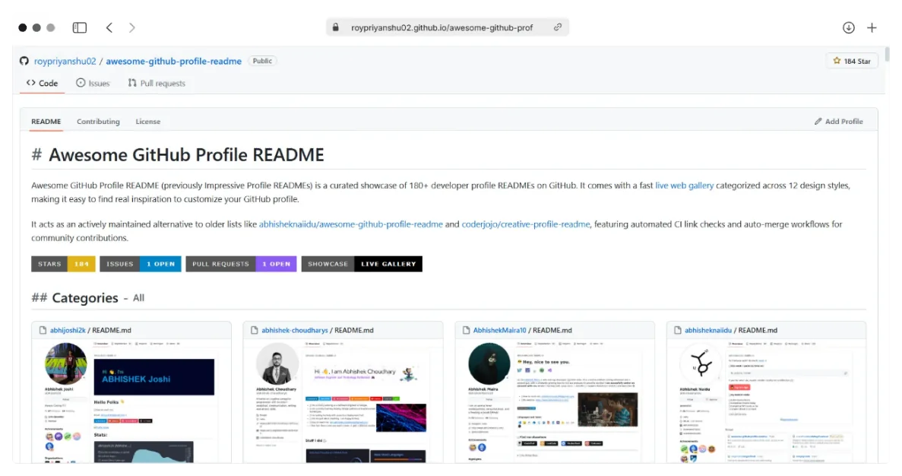

# Awesome GitHub Profile README

Awesome GitHub Profile README (previously Impressive Profile READMEs) is a curated showcase of 180+ developer profile READMEs on GitHub. It comes with a fast [live web gallery](https://roypriyanshu02.github.io/awesome-github-profile-readme/) categorized across 12 design styles, making it easy to find real inspiration to customize your GitHub profile.

It acts as an actively maintained alternative to older lists like [abhisheknaiidu/awesome-github-profile-readme](https://github.com/abhisheknaiidu/awesome-github-profile-readme) and [coderjojo/creative-profile-readme](https://github.com/coderjojo/creative-profile-readme), featuring automated CI link checks and auto-merge workflows for community contributions.

<a href="https://roypriyanshu02.github.io/awesome-github-profile-readme/" align="center">
  <picture>
    <source media="(prefers-color-scheme: dark)" srcset="./site/static/screenshot-dark.webp">
    
  </picture>
</a>

  Remember to give a  if you found this helpful.

## Table of content:

- [Categories](#categories)
  - [A Little Bit of Everything](#a-little-bit-of-everything)
  - [Animation](#animation)
  - [Badges/Icons](#badgesicons)
  - [Code](#code)
  - [Descriptive](#descriptive)
  - [Dynamic](#dynamic)
  - [Fancy Fonts](#fancy-fonts)
  - [Game](#game)
  - [Image](#image)
  - [Innovative](#innovative)
  - [Interactive](#interactive)
  - [Minimalistic](#minimalistic)
- [Articles](#articles)
- [Tools](#tools)
- [Featured Projects](#featured-projects)
- [FAQ](#faq)
- [Contribute](#contribute)
- [License](#license)

## Categories

### A Little Bit of Everything

- [abhishek-choudharys](https://github.com/abhishek-choudharys)
- [AbhishekMaira10](https://github.com/AbhishekMaira10)
- [aemmadi](https://github.com/aemmadi)
- [Ahmad-Sawalqeh](https://github.com/Ahmad-Sawalqeh)
- [Akhil-77](https://github.com/Akhil-77)
- [alicemist](https://github.com/alicemist)
- [anmol098](https://github.com/anmol098)
- [Annarhysa](https://github.com/Annarhysa)
- [anushkawakankar](https://github.com/anushkawakankar)
- [apoorvtyagi](https://github.com/apoorvtyagi)
- [aromalanil](https://github.com/aromalanil)
- [claytonjhamilton](https://github.com/claytonjhamilton)
- [CyrisXD](https://github.com/CyrisXD)
- [DavidsDvm](https://github.com/DavidsDvm)
- [Defcon27](https://github.com/Defcon27)
- [dfreilich](https://github.com/dfreilich)
- [Dhruv-194](https://github.com/Dhruv-194)
- [dipanjanpanja6](https://github.com/dipanjanpanja6)
- [eagleanurag](https://github.com/eagleanurag)
- [gkhan205](https://github.com/gkhan205)
- [guilyx](https://github.com/guilyx)
- [Husayn01](https://github.com/Husayn01)
- [iampavangandhi](https://github.com/iampavangandhi)
- [itgoyo](https://github.com/itgoyo)
- [Jackyu-1999](https://github.com/Jackyu-1999)
- [KasRoudra](https://github.com/KasRoudra)
- [krishealty](https://github.com/krishealty)
- [kztera](https://github.com/kztera)
- [leander-dsouza](https://github.com/leander-dsouza)
- [M4cs](https://github.com/M4cs)
- [MarikIshtar007](https://github.com/MarikIshtar007)
- [MartinHeinz](https://github.com/MartinHeinz)
- [matteobaccan](https://github.com/matteobaccan)
- [mayhemantt](https://github.com/mayhemantt)
- [MayMeow](https://github.com/MayMeow)
- [montasim](https://github.com/montasim)
- [MrStanDu33](https://github.com/MrStanDu33)
- [night0721](https://github.com/night0721)
- [onimur](https://github.com/onimur)
- [PluckyPrecious](https://github.com/PluckyPrecious)
- [poudyalanil](https://github.com/poudyalanil)
- [proghead00](https://github.com/proghead00)
- [Ragdata](https://github.com/Ragdata)
- [rahul-jha98](https://github.com/rahul-jha98)
- [rajaprerak](https://github.com/rajaprerak)
- [Raray-chuan](https://github.com/Raray-chuan)
- [sciencepal](https://github.com/sciencepal)
- [sharannyobasu](https://github.com/sharannyobasu)
- [somekindofwallflower](https://github.com/somekindofwallflower)
- [SP-XD](https://github.com/SP-XD)
- [Spiderpig86](https://github.com/Spiderpig86)
- [Sumanth-Talluri](https://github.com/Sumanth-Talluri)
- [syedareehaquasar](https://github.com/syedareehaquasar)
- [syrashid](https://github.com/syrashid)
- [Taucher2003](https://github.com/Taucher2003)
- [Terabyte17](https://github.com/Terabyte17)
- [theabbie](https://github.com/theabbie)
- [theyounglord](https://github.com/theyounglord)
- [Thomas-George-T](https://github.com/Thomas-George-T)
- [VikashPR](https://github.com/VikashPR)
- [warengonzaga](https://github.com/warengonzaga)
- [walleeva2018](https://github.com/walleeva2018)
- [wdhdev](https://github.com/wdhdev)
- [xiaoluoboding](https://github.com/xiaoluoboding)
- [ysherqawi](https://github.com/ysherqawi)
- [zephyrus21](https://github.com/zephyrus21)
- [zumrudu-anka](https://github.com/zumrudu-anka)

### Animation

- [Amchuz](https://github.com/Amchuz)
- [ari-hacks](https://github.com/ari-hacks)
- [BrunnerLivio](https://github.com/BrunnerLivio)
- [darshan-jain](https://github.com/darshan-jain)
- [demartini](https://github.com/demartini)
- [dephraiim](https://github.com/dephraiim)
- [fnky](https://github.com/fnky)
- [imthaghost](https://github.com/imthaghost)
- [jarvisx17](https://github.com/jarvisx17)
- [jh3y](https://github.com/jh3y)
- [KelviNosse](https://github.com/KelviNosse)
- [KevCui](https://github.com/KevCui)
- [kmoroz](https://github.com/kmoroz)
- [krishnapriya-n](https://github.com/krishnapriya-n)
- [MasonSlover](https://github.com/MasonSlover)
- [muskanrani](https://github.com/muskanrani)
- [okankocyigit](https://github.com/okankocyigit)
- [ozefe](https://github.com/ozefe)
- [Platane](https://github.com/Platane)
- [RaghavK16](https://github.com/RaghavK16)
- [sindresorhus](https://github.com/sindresorhus)
- [SuperSupeng](https://github.com/SuperSupeng)
- [trinib](https://github.com/trinib)
- [vladimirlukyanov](https://github.com/vladimirlukyanov)
- [Xx-Ashutosh-xX](https://github.com/Xx-Ashutosh-xX)

### Badges/Icons

- [adamalston](https://github.com/adamalston)
- [adnanazmee](https://github.com/adnanazmee)
- [ashleymavericks](https://github.com/ashleymavericks)
- [br3ndonland](https://github.com/br3ndonland)
- [dereknguyen269](https://github.com/dereknguyen269)
- [hussainweb](https://github.com/hussainweb)
- [milaan9](https://github.com/milaan9)
- [Purvesh77](https://github.com/Purvesh77)
- [rafi0101](https://github.com/rafi0101)
- [rishavanand](https://github.com/rishavanand)
- [techytushar](https://github.com/techytushar)
- [terrytangyuan](https://github.com/terrytangyuan)
- [vbriand](https://github.com/vbriand)
- [venkivijay](https://github.com/venkivijay)

### Code

- [CrazyChickenDev](https://github.com/CrazyChickenDev)
- [KiSobral](https://github.com/KiSobral)
- [laohanme](https://github.com/laohanme)
- [monkindey](https://github.com/monkindey)
- [nurofsun](https://github.com/nurofsun)
- [roypriyanshu02](https://github.com/roypriyanshu02)
- [Thaiane](https://github.com/Thaiane)
- [Zhenye-Na](https://github.com/Zhenye-Na)

### Descriptive

- [akshitagupta15june](https://github.com/akshitagupta15june)
- [AnzenKodo](https://github.com/AnzenKodo)
- [ApurvShah007](https://github.com/ApurvShah007)
- [arthurspk](https://github.com/arthurspk)
- [cheesits456](https://github.com/cheesits456)
- [dayyass](https://github.com/dayyass)
- [DennisHartrampf](https://github.com/DennisHartrampf)
- [ethomson](https://github.com/ethomson)
- [f](https://github.com/f)
- [filiptronicek](https://github.com/filiptronicek)
- [garimasingh128](https://github.com/garimasingh128)
- [gautamkrishnar](https://github.com/gautamkrishnar)
- [halfrost](https://github.com/halfrost)
- [harshkumarkhatri](https://github.com/harshkumarkhatri)
- [Nanra](https://github.com/Nanra)
- [orhun](https://github.com/orhun)
- [prathimacode-hub](https://github.com/prathimacode-hub)
- [roaldnefs](https://github.com/roaldnefs)
- [saviomartin](https://github.com/saviomartin)
- [seanpm2001](https://github.com/seanpm2001)
- [SoupyzInc](https://github.com/SoupyzInc)
- [vidursatija](https://github.com/vidursatija)
- [XanderRubio](https://github.com/XanderRubio)
- [xtenzQ](https://github.com/xtenzQ)

### Dynamic

- [abhijoshi2k](https://github.com/abhijoshi2k)
- [abhisheknaiidu](https://github.com/abhisheknaiidu)
- [alirealasad](https://github.com/alirealasad)
- [Aveek-Saha](https://github.com/Aveek-Saha)
- [Ayon-SSP](https://github.com/Ayon-SSP)
- [blackcater](https://github.com/blackcater)
- [centrumek](https://github.com/centrumek)
- [codestackr](https://github.com/codestackr)
- [cxyfreedom](https://github.com/cxyfreedom)
- [dailyrandomphoto](https://github.com/dailyrandomphoto)
- [FaberSanZ](https://github.com/FaberSanZ)
- [Find-NICK](https://github.com/Find-NICK)
- [formidablae](https://github.com/formidablae)
- [hoangsvit](https://github.com/hoangsvit)
- [jgphilpott](https://github.com/jgphilpott)
- [kittinan](https://github.com/kittinan)
- [lowlighter](https://github.com/lowlighter)
- [Manobal-Singh-Bagady](https://github.com/Manobal-Singh-Bagady)
- [maximousblk](https://github.com/maximousblk)
- [moepoi](https://github.com/moepoi)
- [mokkapps](https://github.com/mokkapps)
- [mscoutermarsh](https://github.com/mscoutermarsh)
- [nachoverdon](https://github.com/nachoverdon)
- [natainditama](https://github.com/natainditama)
- [natemoo-re](https://github.com/natemoo-re)
- [ouuan](https://github.com/ouuan)
- [probablykasper](https://github.com/probablykasper)
- [RaoHai](https://github.com/RaoHai)
- [simonw](https://github.com/simonw)
- [surajshende247](https://github.com/surajshende247)
- [swyxio](https://github.com/swyxio)
- [tallguyjenks](https://github.com/tallguyjenks)
- [thmsgbrt](https://github.com/thmsgbrt)
- [tuanductran](https://github.com/tuanductran)
- [yutkat](https://github.com/yutkat)

### Fancy Fonts

- [Qiamast](https://github.com/Qiamast)
- [Raymo111](https://github.com/Raymo111)

### Game

- [benjaminsampica](https://github.com/benjaminsampica)
- [DoubleGremlin181](https://github.com/DoubleGremlin181)
- [HFO4](https://github.com/HFO4)
- [JonathanGin52](https://github.com/JonathanGin52)
- [kylepls](https://github.com/kylepls)
- [marcizhu](https://github.com/marcizhu)
- [rossjrw](https://github.com/rossjrw)
- [timburgan](https://github.com/timburgan)

### Image

- [afc163](https://github.com/afc163)
- [innng](https://github.com/innng)
- [luizakuze](https://github.com/luizakuze)
- [oussamabouchikhi](https://github.com/oussamabouchikhi)
- [SoorajSNBlaze333](https://github.com/SoorajSNBlaze333)
- [Tynab](https://github.com/Tynab)
- [vaaski](https://github.com/vaaski)
- [zackkrida](https://github.com/zackkrida)

### Innovative

- [AlexMartinFR](https://github.com/AlexMartinFR)
- [andyruwruw](https://github.com/andyruwruw)
- [HwangTaehyun](https://github.com/HwangTaehyun)
- [ileriayo](https://github.com/ileriayo)
- [jaywcjlove](https://github.com/jaywcjlove)
- [JessicaLim8](https://github.com/JessicaLim8)
- [khalby786](https://github.com/khalby786)
- [liununu](https://github.com/liununu)
- [metalim](https://github.com/metalim)
- [rafnixg](https://github.com/rafnixg)
- [raklaptudirm](https://github.com/raklaptudirm)
- [Ridermansb](https://github.com/Ridermansb)
- [saadeghi](https://github.com/saadeghi)
- [samujjwaal](https://github.com/samujjwaal)
- [ShahriarShafin](https://github.com/ShahriarShafin)
- [Sumyak-Jain](https://github.com/Sumyak-Jain)
- [thewhiteh4t](https://github.com/thewhiteh4t)
- [WaylonWalker](https://github.com/WaylonWalker)

### Interactive

- [DenverCoder1](https://github.com/DenverCoder1)

### Minimalistic

- [achyutghosh](https://github.com/achyutghosh)
- [akasrai](https://github.com/akasrai)
- [alwinw](https://github.com/alwinw)
- [anuraghazra](https://github.com/anuraghazra)
- [aralroca](https://github.com/aralroca)
- [artogahr](https://github.com/artogahr)
- [arturssmirnovs](https://github.com/arturssmirnovs)
- [athul](https://github.com/athul)
- [d-koppenhagen](https://github.com/d-koppenhagen)
- [daniakash](https://github.com/daniakash)
- [gargakshit](https://github.com/gargakshit)
- [jayrajroshan](https://github.com/jayrajroshan)
- [kha7iq](https://github.com/kha7iq)
- [lucasvazq](https://github.com/lucasvazq)
- [M0nica](https://github.com/M0nica)
- [moertel](https://github.com/moertel)
- [novatorem](https://github.com/novatorem)
- [peterthehan](https://github.com/peterthehan)
- [pr2tik1](https://github.com/pr2tik1)
- [rafaballerini](https://github.com/rafaballerini)
- [sagar-viradiya](https://github.com/sagar-viradiya)
- [ShaanCoding](https://github.com/ShaanCoding)
- [sriharikapu](https://github.com/sriharikapu)
- [vanshkapoor](https://github.com/vanshkapoor)
- [xunzhuo](https://github.com/xunzhuo)
- [YuzuZensai](https://github.com/YuzuZensai)
- [Zheeeng](https://github.com/Zheeeng)

## Articles

- [3 Ways to Add an Image to the GitHub README](https://www.seancdavis.com/posts/three-ways-to-add-image-to-github-readme/) _- Sean_
- [Adding custom HTML and CSS to GitHub README](https://pragmaticpineapple.com/adding-custom-html-and-css-to-github-readme/) _- Nikola Đuza_
- [Build a Stunning README For Your GitHub Profile](https://martinheinz.dev/blog/29) _- Martin Heinz_
- [Creating a GitHub Profile README](https://docs.github.com/en/free-pro-team@latest/github/setting-up-and-managing-your-github-profile/managing-your-profile-readme) _- GitHub Docs_
- [Dynamically Generated Github Stats For Your Profile ReadMe](https://dev.to/anuraghazra/dynamically-generated-github-stats-for-your-profile-readme-o4g) _- Anurag Hazra_
- [Water Waving Effect Using Html, Css and Svg](https://fantinel.dev/github-profile-readme) _- Matt Fantinel_

## Tools

- [Badges](https://shields.io/) - Customizable badges and labels for GitHub profiles and project READMEs.
- [GitHub profile readme generator](https://gprm.itsvg.in/) - Generates a GitHub profile README.
- [GitHub profile readme generator](https://rahuldkjain.github.io/gh-profile-readme-generator/) - Generates a profile README in minutes.
- [GitHub readme generator](https://readme.so/) - Simple editor to customize sections for your README.
- [Github Readme stats](https://github.com/anuraghazra/github-readme-stats) - Dynamically generated stats for your GitHub README.
- [GitHub stat trophies](https://github.com/ryo-ma/github-profile-trophy) - Add dynamically generated GitHub Stat Trophies.
- [Markdown badges](https://ileriayo.github.io/markdown-badges/) - Add badges to your profile and project READMEs.
- [Markdown cheatsheet](https://github.com/adam-p/markdown-here/wiki/Markdown-Cheatsheet) - A quick reference markdown cheatsheet.
- [Markdown editor](https://dillinger.io/) - Live online markdown editor.
- [Readme typing animation](https://readme-typing-svg.demolab.com/demo/) - SVG widget that simulates typing and deleting text.
- [Streak stats](https://streak-stats.demolab.com/demo/) - Display total contributions and contribution streaks on your profile README.
- [SVG icons](https://simpleicons.org/) - Over 2,400 free SVG icons of popular brands.

## Featured Projects

- **[Spelunk](https://github.com/roypriyanshu02/spelunk)** - An AST-powered codebase indexing & query tool for fast developer exploration. Read the [release blog post](https://roypriyanshu02.hashnode.dev/ai-agent-codebase-indexer-skill-spelunk) for details.

## FAQ

### What is a GitHub Profile README?

A GitHub Profile README is a markdown file placed in a special repository matching your GitHub username. As detailed in the [GitHub Documentation](https://docs.github.com/en/account-and-profile/setting-up-and-managing-your-github-profile/customizing-your-profile/managing-your-profile-readme), it renders on your public profile page to showcase your tech stack, projects, and live stats.

### How do I make my profile README stand out?

To build a clean, memorable profile that highlights your work effectively:

1. **Clear Positioning:** Lead with a concise tagline defining your focus, primary tech stack, and current projects—keep introductions scannable and direct.
2. **Tech Stack Badges:** Group your core tools cleanly using [Shields.io](https://shields.io/) or [Simple Icons](https://simpleicons.org/) instead of crowding the page with excessive badges.
3. **Dynamic Activity Widgets:** Display real-time contribution metrics and language stats using [GitHub Readme Stats](https://github.com/anuraghazra/github-readme-stats) or showcase contribution streaks with [Streak Stats](https://streak-stats.demolab.com/demo/).
4. **Featured Projects:** Showcase your top 2–3 active repositories or open-source contributions with short descriptions and direct links rather than long static lists.
5. **Subtle Motion:** Add dynamic header text using [Readme Typing SVG](https://readme-typing-svg.demolab.com/demo/) or visual contribution animations to bring the layout to life.
6. **Curated Showcase:** Explore over 180 profile examples in our [Live Showcase Gallery](https://roypriyanshu02.github.io/awesome-github-profile-readme/) to find layout styles matching your work.

### How do I add my profile README to this list?

Submit a pull request updating `README.md` following our [Contributing Guide](CONTRIBUTING.md). Our automated GitHub Actions workflow will check your submission and merge eligible pull requests automatically.

## Contribute

Contributions are welcome! Read the [Contributing Guide](CONTRIBUTING.md) to get started.

## License

This project is dual-licensed under the following terms:

- **Source Code:** [MIT License](https://opensource.org/licenses/MIT)
- **Documentation & Data:** [Creative Commons Attribution 4.0 International (CC BY 4.0)](https://creativecommons.org/licenses/by/4.0/)

See [LICENSE](LICENSE) for details.
